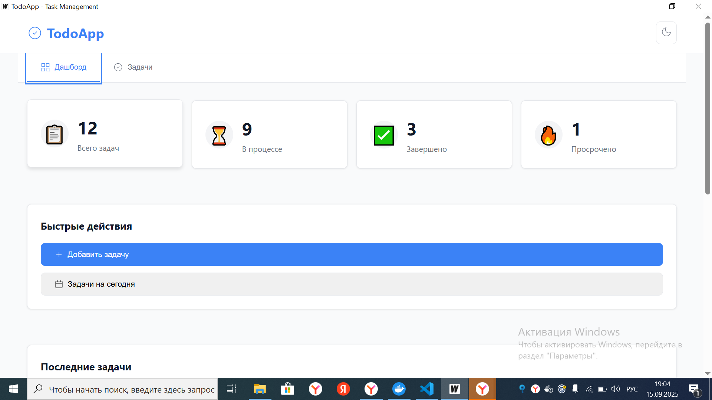
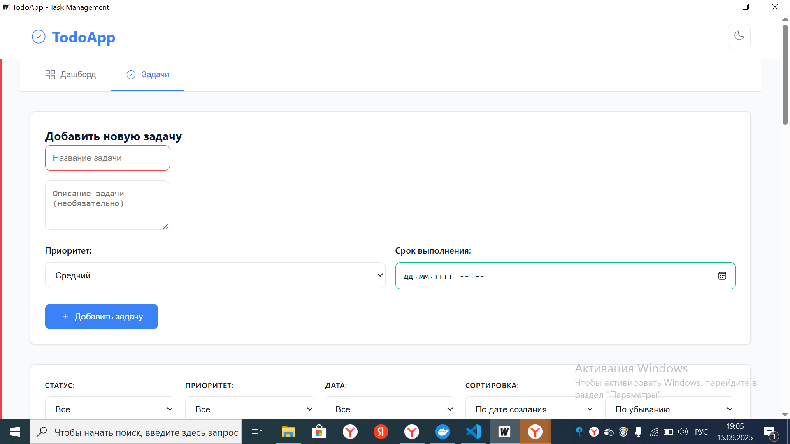
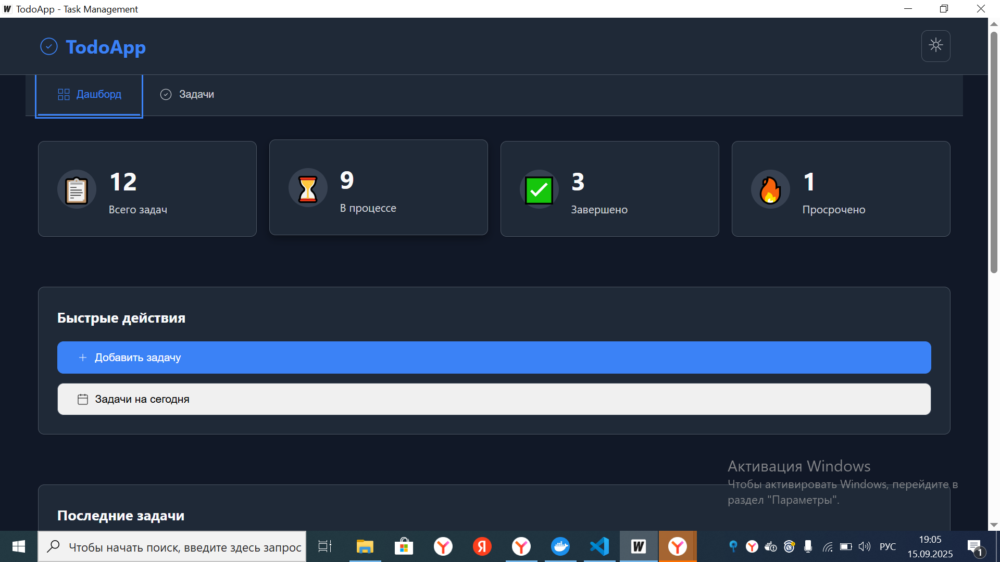
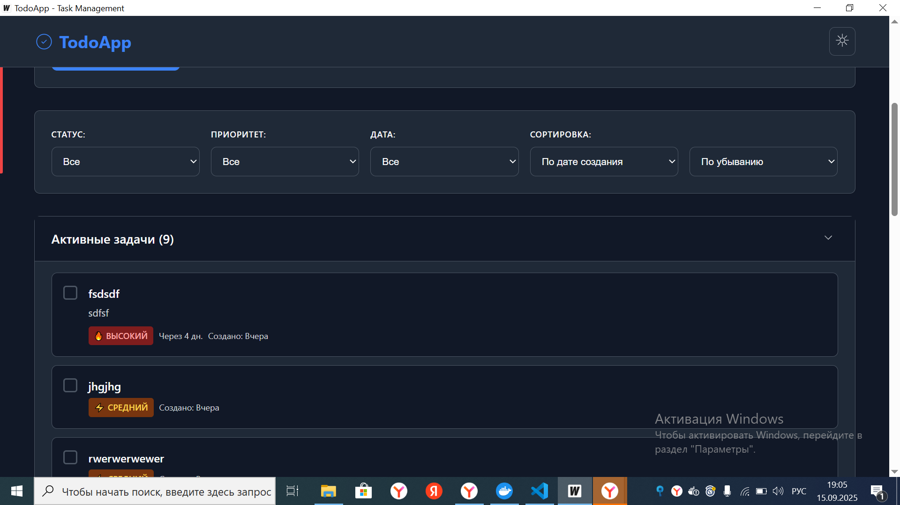

# TodoApp

> Современное десктопное приложение для управления задачами

<div align="center">


</div>

## 📋 О проекте

TodoApp — это кроссплатформенное десктопное приложение для управления задачами, разработанное с использованием современного стека технологий. Приложение сочетает мощь Go на backend'е с интуитивным JavaScript интерфейсом.

### ✨ Особенности

- **🎨 Современный интерфейс** — светлая и темная темы
- **📱 Адаптивный дизайн** — корректно работает при любом размере окна
- **💾 Надежное хранение** — данные сохраняются в PostgreSQL
- **🔄 Умная синхронизация** — автоматическое обновление интерфейса
- **🎯 Гибкая фильтрация** — сортировка по статусу, дате и приоритету

## 🚀 Быстрый старт

### Автоматический запуск
```bash
git clone <repository-url>
cd todoapp
make start
```

### Ручной запуск
```bash
# Запуск базы данных
docker-compose up --build -d

# Запуск приложения
wails dev
```

## 🏗️ Архитектура

```
┌─────────────────┐    ┌──────────────────┐    ┌─────────────────┐
│   Frontend      │    │     Backend      │    │    Database     │
│                 │    │                  │    │                 │
│  JavaScript +   │◄──►│  Go + Wails      │◄──►│   PostgreSQL    │
│     CSS         │    │                  │    │                 │
└─────────────────┘    └──────────────────┘    └─────────────────┘

            Repository ► Service ► Usecase
```

## 📦 Технические требования

| Компонент | Версия |
|-----------|---------|
| Go | 1.19+ |
| Node.js | 16+ |
| PostgreSQL | 12+ |
| Docker | Latest |
| Wails CLI | v2 |

## 🎯 Функциональность

### ✅ Выполненные задачи

#### 🖥️ Интерфейс пользователя (25/25 баллов)
- [x] Поле ввода и кнопка добавления задач
- [x] Отображение списка всех задач
- [x] CSS стилизация с цветовыми индикаторами
- [x] Адаптивная верстка для разных размеров окон
- [x] Переключение светлой/темной темы

#### ➕ Добавление задач (20/20 баллов)
- [x] Создание новых задач с валидацией
- [x] Поддержка даты и времени выполнения
- [x] Система приоритетов (низкий, средний, высокий)

#### 🗑️ Удаление задач (15/15 баллов)
- [x] Удаление задач из списка
- [x] Модальное окно подтверждения удаления

#### ⚡ Управление задачами (30/30 баллов)
- [x] Отметка задач как выполненных
- [x] Зачеркивание текста выполненных задач
- [x] Перемещение в отдельный раздел "Выполненные"
- [x] Возврат задач в статус "Активные"

#### 💾 Сохранение данных (50/50 баллов)
- [x] Постоянное хранение при закрытии приложения
- [x] Автоматическая загрузка при запуске
- [x] Интеграция с PostgreSQL
- [x] Многослойная архитектура (Repository → Service → Usecase)

#### 🔍 Фильтрация и сортировка (20/20 баллов)
- [x] Фильтрация по статусу (все/активные/выполненные)
- [x] Сортировка по дате создания
- [x] Сортировка по приоритету
- [x] Фильтрация по временным периодам

**Общий результат: 160/160 баллов**

## 🎮 Основные возможности

### 📊 Дашборд
- Статистика по задачам в реальном времени
- Последние добавленные задачи
- Список просроченных задач
- Быстрые действия

### 🔧 Управление задачами
- Создание с полным набором атрибутов
- Встроенный редактор задач
- Безопасное удаление с подтверждением
- Переключение статусов одним кликом

### 🎛️ Фильтрация и поиск
- Множественные критерии фильтрации
- Гибкая сортировка данных
- Временные фильтры
- Приоритетная сортировка

## ⚠️ Известные ограничения

> **Важно:** В текущей версии есть проблема с автоматическим обновлением интерфейса

**Симптомы:**
- После операций с задачами изменения могут не отображаться сразу
- Требуется переключение между вкладками для обновления данных

**Временное решение:**
1. После создания/редактирования/удаления задач
2. Переключитесь между вкладками "Дашборд" и "Задачи"
3. Данные обновятся автоматически

**Дополнительно:**
- Для появления кнопок управления окном нужно изменить размер окна

## 🛠️ Команды разработки

```bash
# Режим разработки
wails dev

# Производственная сборка
wails build

# Только база данных
docker-compose up postgres -d

# Остановка сервисов
docker-compose down

# Полная пересборка
docker-compose up --build -d
```

## 📁 Структура проекта

```
todoapp/
├── 🏗️  app/
│   ├── pkg/
│   │   ├── config/          # Конфигурация
│   │   ├── database/        # Подключение к БД
│   │   ├── models/          # Модели данных
│   │   ├── repository/      # Слой репозитория
│   │   ├── service/         # Бизнес-логика
│   │   └── usecase/         # Сценарии использования
│   └── app.go              # Основной класс приложения
├── 🎨 frontend/
│   ├── src/
│   │   ├── main.js         # JavaScript логика
│   │   ├── style.css       # Основные стили
│   │   └── app.css         # Стили приложения
│   └── index.html          # HTML шаблон
├── 🗄️  migrations/         # SQL миграции
├── 🐳 docker-compose.yml   # Docker конфигурация
├── ⚙️  wails.json          # Wails настройки
├── 📋 Makefile            # Команды сборки
└── 📄 go.mod              # Go зависимости
```

## 🔧 Настройка окружения

### Переменные среды
```bash
# База данных
export DB_HOST=localhost
export DB_PORT=5432
export DB_USER=postgres
export DB_PASSWORD=postgres
export DB_NAME=todoapp
export DB_SSL_MODE=disable

# Приложение
export APP_ENV=development
```

### Docker конфигурация
```yaml
# docker-compose.yml
services:
  postgres:
    image: postgres:13
    environment:
      POSTGRES_DB: todoapp
      POSTGRES_USER: postgres
      POSTGRES_PASSWORD: postgres
    ports:
      - "5432:5432"
    volumes:
      - postgres_data:/var/lib/postgresql/data
      - ./migrations:/docker-entrypoint-initdb.d
```

## 📸 Скриншоты

| Дашборд | Управление задачами |
|---------|-------------------|
| ![Dashboard] | ![Tasks] |

| Темная тема | Фильтры |
|-------------|---------|
| ![Dark Theme] | ![Filters] |


## 👨‍💻 Для разработчиков

### Установка зависимостей
```bash
# Go модули
go mod download

# Frontend зависимости (если есть)
npm install
```

### Запуск тестов
```bash
# Тесты Go
go test ./...

# Линтер
golangci-lint run
```

## 📄 Лицензия

Проект создан в рамках тестового задания и предназначен для демонстрации навыков разработки.

---

<div align="center">

**Сделано с ❤️ на Go + JavaScript**


</div>